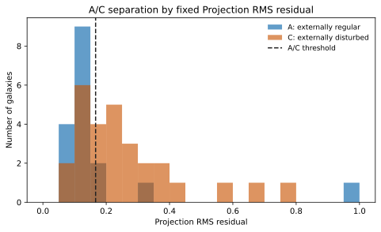
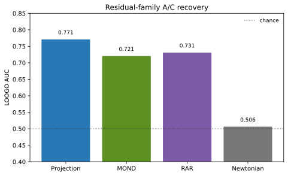
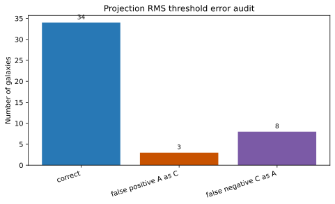
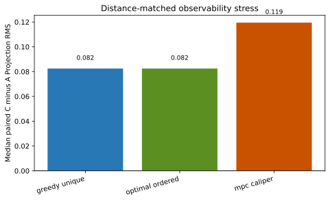

# Residual-shape inference and external-proxy audit of structural disturbance in SPARC rotation curves

## Abstract

We ask whether fixed rotation-curve residual-shape features can recover externally reviewed structural-disturbance labels in SPARC galaxies, and whether independent H I disturbance proxies support the same diagnostic direction. The study reverses the Paper 1 audit: the A/C labels are treated as frozen external targets, while residual features are evaluated as predictors under leave-one-galaxy-out thresholding, shuffled-label null tests, bootstrap uncertainty, baseline-family controls, and observability stress checks. The primary internal feature, `Projection_RMS`, reaches LOOGO AUC=0.771008403 with shuffled-label p=0.002000000 and bootstrap 95% AUC interval [0.600802469, 0.909100262]. MOND-simple and empirical RAR-like residual scores also separate A/C systems, whereas a Newtonian baryonic RMS control is near chance, indicating a low-acceleration residual-family effect rather than projection-formula uniqueness. External proxy readouts are supportive but not decisive: WHISP resolved-HI asymmetry is directionally aligned in a small overlap, WHISP morphology is mixed, Reynolds/LVHIS is promising but underpowered, and ALFALFA/HALOGAS are weak or control-like. A THINGS expansion route was closed as not score-ready after required machine-readable mass-model columns were not recovered. The result is therefore a reproducible residual-inference and external-proxy audit, not a Tau Core validation claim, not gravity-model selection, and not independent paper-grade external validation.

## 1. Introduction

Rotation-curve residuals are usually discussed as model error, but their radial structure can also carry information about non-equilibrium dynamics, non-circular motions, pressure support, beam smearing, inclination, and source-dependent observability. Paper 1 established a residual-blind association between externally assigned structural-disturbance labels and low-acceleration residual scatter in SPARC. Here we ask the inverse diagnostic question: can fixed residual-shape features recover those external labels better than chance?

The scope is deliberately narrow. This paper does not use residuals to redefine the labels, does not validate Tau Core, and does not select a unique gravity law. It tests whether a frozen residual feature map contains recoverable information about externally reviewed A/C disturbance classes, then checks whether independent H I disturbance proxies point in the same direction.

## 2. Data and Frozen Inputs

The working A/C sample contains 45 SPARC galaxies inherited from the Paper 1 reproducibility packet: 17 externally regular A systems and 28 externally disturbed C systems. B-class systems remain excluded from the primary target labels because they encode uncertainty by construction. The residual features are computed from the fixed Paper 1 point map and are not retrained on the external-proxy catalogs.

The public packet contains the derived tables, scripts, figures, and audit records needed to regenerate the diagnostic results. Raw survey products and raw SPARC rotmod files are not redistributed by this repository.

## 3. Residual-Shape Endpoint

The primary endpoint is `Projection_RMS`, the galaxy-level RMS of a fixed low-acceleration projection residual. It is used as an operational residual-shape score rather than as a physical proof of the projection formula. The key design choice is that the score is fixed before the external-proxy readouts are interpreted.

## 4. Validation Design

The primary internal validation uses leave-one-galaxy-out thresholding. For each held-out galaxy, the decision threshold is recomputed from the remaining A and C systems as the midpoint between their class medians. A shuffled-label null preserves class counts and tests whether the observed AUC is expected under random A/C labels. Bootstrap resampling estimates sample-size uncertainty. These tests are internal to SPARC and should not be described as independent validation.

## 5. Primary Results

| ResultID | Quantity | Value | Interpretation | ClaimBoundary |
| --- | --- | --- | --- | --- |
| R1 | Projection_RMS LOOGO AUC | 0.771008403 | primary internal residual-shape diagnostic | SPARC-internal class recovery, not external validation |
| R2 | Projection_RMS shuffled-label p | 0.002000000 | unlikely under random A/C labels in this packet | null test only, not independent replication |
| R3 | MOND-simple RMS LOOGO AUC | 0.720588235 | low-acceleration residual-family support | reduces projection uniqueness claim |
| R4 | RAR-like RMS LOOGO AUC | 0.731092437 | low-acceleration residual-family support | not gravity-model selection |
| R5 | Newtonian baryonic RMS LOOGO AUC | 0.506302521 | near-chance control | does not prove low-acceleration physics by itself |

The primary signal is positive and statistically sharp in the frozen internal packet. The result is strongest when stated as class recovery from residual shape, not as a physical detection of an underlying field.

## 6. Baseline-Family Comparison

The baseline comparison weakens any projection-specific claim but strengthens the broader phenomenological result. MOND-simple and empirical RAR-like residual scores also separate A/C systems, while the Newtonian baryonic RMS score is near chance. The defensible conclusion is that A/C separation is concentrated in low-acceleration residual-family scores.

This pattern is compatible with several physical readings: disturbed systems may violate smooth equilibrium assumptions, non-circular motions may be more important in low-acceleration regions, or observability may expose more disturbance structure in particular subsets. The present data do not distinguish these explanations.

## 7. Failure Modes

The error audit is retained because a useful diagnostic must show where it fails. False-negative C systems demonstrate that externally disturbed galaxies do not always produce large residual burden under a smooth rotation-curve score. False-positive A systems show that residual structure can arise without a strong external disturbance label.

These failures are not relabeling evidence. They are targets for follow-up inspection, especially where residual morphology, inclination, radial coverage, and H I kinematic asymmetry disagree.

## 8. External Proxy Readouts

| FamilyID | JoinedN | PrimaryMetric | Status | ManuscriptRole |
| --- | --- | --- | --- | --- |
| WHISP_RESOLVED | 14 | Pearson=0.391218683;AUC=0.714285714 | directional_support_but_small_overlap | supporting_external_readout |
| WHISP_MORPH | 25 | AsymmetryA_AUC=0.644230769;MorphologyBurden_AUC=0.506410256 | mixed_directional_support | supporting_morphology_readout |
| REYNOLDS_LVH | 6 | AvelPearson=0.375346400;AvelAUC=0.777777778 | promising_below_minimum_n | non_WHISP_candidate_support |
| ALFALFA | 22 | Pearson_Af=0.145935541;AUC_high_low=0.472222222 | weak_or_non_directional | broad_profile_asymmetry_control |
| HALOGAS | 5 | Pearson=0.216413317;AUC=0.500000000 | weak_control_only | small_overlap_control |
| THINGS_ROUTE2 | 0_score_ready | closed_not_score_ready;THINGS_N15_not_reached | closed_not_score_ready | negative_audit_appendix |

WHISP resolved-HI asymmetry is the strongest supportive external readout, but its overlap is small. WHISP morphology is mixed, Reynolds/LVHIS is promising but below the frozen N>=15 gate, and ALFALFA/HALOGAS do not provide strong directional support. The external evidence therefore supports the paper as an audit, not as an independent validation result.

## 9. THINGS Route2 Negative Audit

The THINGS expansion route was audited because it could have raised the independent-control overlap. It is now closed as not score-ready. The required machine-readable per-radius mass-model columns were not recovered for the missing galaxies, and the reconstruction route failed its photometry and solver-validation gates before any missing-galaxy scores were computed.

This negative audit should remain visible. It documents why the paper does not claim THINGS N>=15, avoids plot-digitized or synthetic mass models, and prevents endpoint-driven data recovery from entering the evidence chain.

## 10. Observability and Systematics

Observability remains the main scientific caveat. Nearby galaxies can reveal asymmetry and morphological disturbance more easily than distant systems; inclination, beam smearing, asymmetric drift, pressure support, and non-circular motion can all alter residual morphology. The current controls reduce but do not eliminate these concerns.

Accordingly, the result should be read as a reproducible SPARC diagnostic association with external-proxy context, not as a selection-function-proof physical inference.

## 11. Claim Boundary

Allowed claim: fixed residual-shape features recover externally reviewed A/C disturbance class better than chance in the current SPARC packet, and several external proxy readouts provide mixed but informative context.

Forbidden claims: Tau Core validation, gravity-model selection, projection-formula uniqueness, replacement of external labels by residual-only labels, broad independent external validation, or THINGS route2 positive evidence.

## 12. Phase II

The next paper-grade step is a held-out external source-family test with N>=15, a frozen evidence rule, no velocity-endpoint refit, explicit observability covariates, and predefined failure conditions. A negative Phase II result should be treated as evidence that the present association is SPARC-specific, proxy-specific, or observability-driven.
